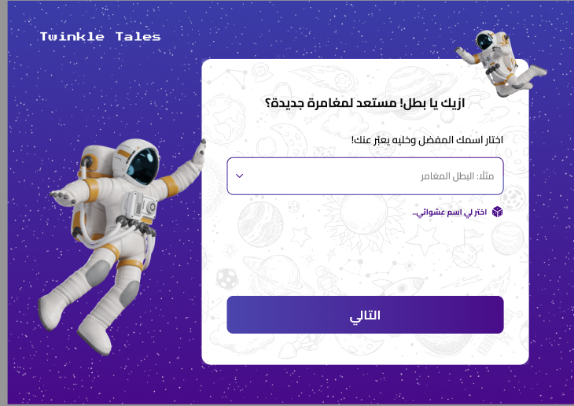
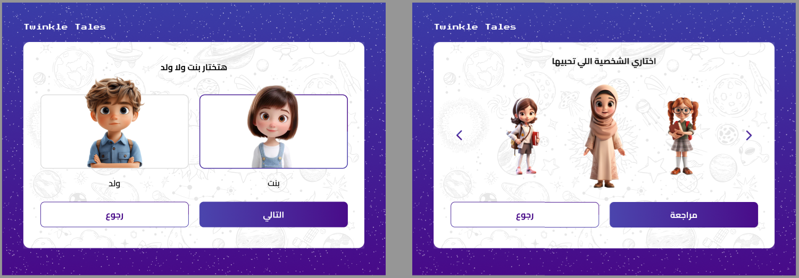
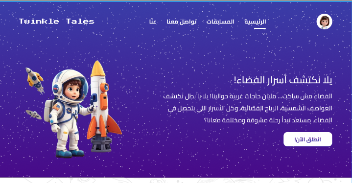
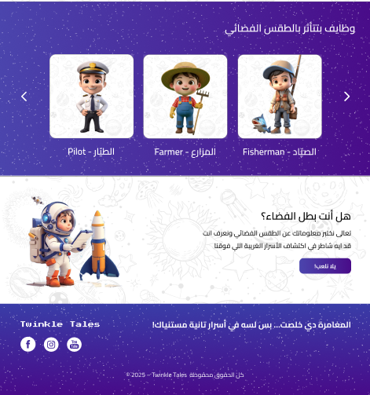
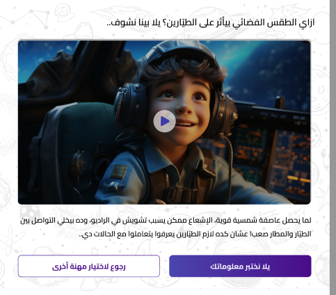
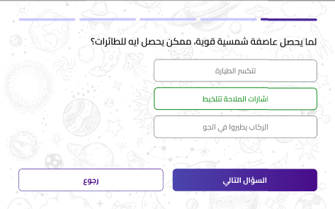

<div align="center">
  <h1>Twinkle Tales – Backend APIs</h1>
  <p><strong>Interactive Educational Space Adventure Platform</strong></p>
  
  <p style="max-width: 700px; margin: 20px auto; font-size: 1.1em;">
    Laravel-powered backend for an engaging kids' learning game where children explore space missions, choose exciting roles (Pilot, Astronaut, Farmer...), answer quizzes, and advance through levels.
  </p>

 
  <div style="margin: 20px 0;">
    
    
    
    
  </div>

  <p><strong>Quick Demo</strong></p>
  

  <br><br>
</div>

## 🌟 Features

- Guest registration with unique code (no email/password needed for kids)
- Role selection (Pilot, Astronaut, Farmer...) with descriptions & videos
- Level-based quizzes with questions and answers
- Real-time progress tracking (current level + score)
- Clean RESTful API endpoints ready for any frontend (Flutter, React, etc.)

## 📌 Main API Endpoints

| Method | Endpoint                        | Description                              |
|--------|---------------------------------|------------------------------------------|
| POST   | /api/register                   | Register new guest user with unique code |
| POST   | /api/login                      | Login using guest code                   |
| GET    | /api/roles                      | Get all available roles                  |
| POST   | /api/users/{user}/choose-role   | Assign a role to user                    |
| GET    | /api/quiz/{level}               | Get quiz questions for a level           |
| POST   | /api/progress/update            | Update user level & score                |
| GET    | /api/progress/{user_id}         | Get user progress                        |

## 🚀 Quick Setup

1. **Clone & install**
   ```bash
   git clone https://github.com/amiramahmoud77/twinkle-tales.git
   cd twinkle-tales
   composer install
   ```

2. **Configure .env**
   ```bash
   cp .env.example .env
   ```
   Update database credentials:
   ```env
   DB_DATABASE=twinkle_tales
   DB_USERNAME=root
   DB_PASSWORD=
   ```

3. **Run migrations & seed**
   ```bash
   php artisan key:generate
   php artisan migrate --seed
   ```

4. **Start server**
   ```bash
   php artisan serve
   ```
   API base URL: **http://127.0.0.1:8000/api**

## 📸 Screenshots

### Highlights
<div style="display: flex; justify-content: center; gap: 20px; flex-wrap: wrap; margin: 30px 0;">
  
  
  
</div>

### More Screenshots
<div style="display: flex; flex-wrap: wrap; gap: 15px; justify-content: center;">
  
  
  
  <!-- أضيفي باقي الصور هنا بنفس الطريقة -->
</div>

## 🛠 Tech Stack

- Laravel 12 (PHP 8.2)
- MySQL Database
- Eloquent ORM
- RESTful API
- Composer for dependencies


